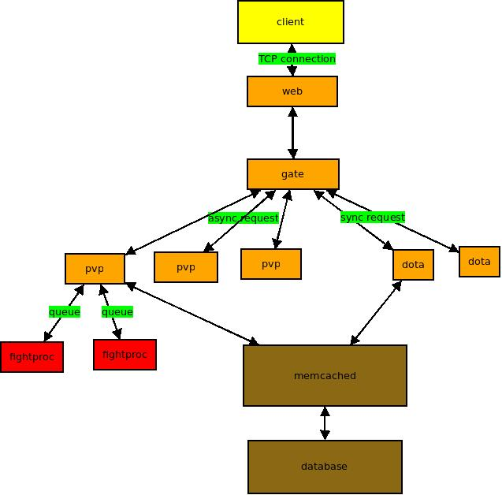

服务器架构
==========

一个服务器就是一组不断运行的进程，它们负责接收客户端的请求， 对请求作出响应，
处理游戏的逻辑以及数据持久化。

web进程负责和客户端建立TCP连接，负责网络IO通信，是服务器通信的最底层。使用Twisted
进行异步IO通信。

gate进程负责玩家登陆和退出，请求的路由，以及对客户端数据的广播。

dota进程为游戏逻辑进程，通过为客户端实现同步请求，实现游戏逻辑。

pvp进程为游戏逻辑进程，通过为客户端实现异步请求，实现逻辑进程。每一场pvp战斗都会
启动一个fightproc进程，负责处理pvp战斗逻辑。fightproc通过python轻量级进程multiprocessing
实现，fightproc进程和父进程pvp进程通过共享内存队列来进程通信。

memcached进程为数据缓存进程，通过和dota以及pvp通信来进程数据交互来保持游戏实体数据的一致性。

database为游戏数据库，通过和memcached通信来数据持久化。
